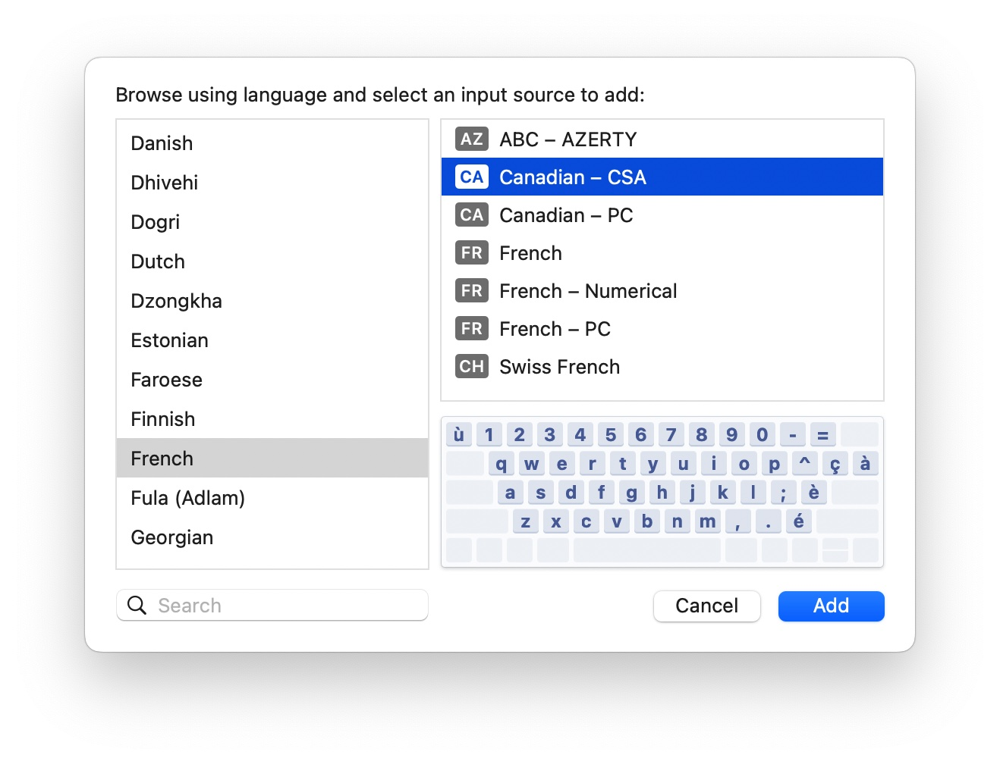

# How to Build a Blog


# How to Build a Blog - Test

run command in below dir

```sh
 cd /Users/danielmei/Blog/mysite
 hugo new posts/first_post.md
```

```
danielmei@Daniels-MacBook-Pro mysite %   hugo new posts/first_post.md
Content "/Users/danielmei/Blog/mysite/content/posts/first_post.md" created
```

## pictures




